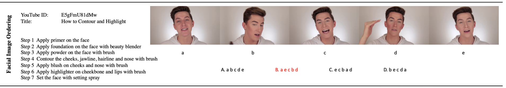
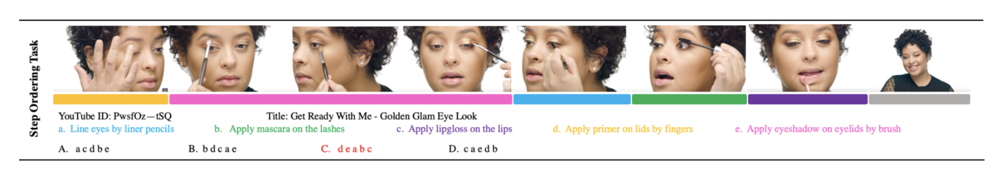

# Introduction

This is baseline code for [YouMakeup VQA Challenge](https://languageandvision.github.io/youmakeup_vqa/index.html). 
For implementation details, please refer to [YouMakeup VQA Challenge: Towards Fine-grained Action Understanding inDomain-Specific Videos](http://note.youdao.com/).

## Image Ordering Baseline

The Facial Image Ordering Sub-Challenge is to sort a set of facial images from
a video into the correct order according to the given step descriptions, shown in the following figure.

<div style="align: center">

</div>

We designed two baseline models for this task:

- One is Image-only Ordering model (*Pair-wise*), to reproduce it, please refer to [./image_ordering/Pairwise ](https://github.com/AIM3-RUC/Youmakeup_Baseline/tree/master/image_ordering/Pairwise).

- The other is Text-aware Image Ordering model (*TIRG*), to reproduce it, please refer to [./image_ordering/TIRG ](https://github.com/AIM3-RUC/Youmakeup_Baseline/tree/master/image_ordering/TIRG).


The shared data preparation instructions for two models is at [./image_ordering](https://github.com/AIM3-RUC/Youmakeup_Baseline/tree/master/image_ordering).

## Step Ordering Baseline
The Step Ordering Sub-Challenge is to sort a set of action descriptions into the right order according to the order of these actions in the video as shown in the following figure:

<div style="align: center">

</div>

We prepared two kinds of baseline for this task. 

- One is Text-only Ordering, to reproduce it, please refer to [./step_ordering/Pairwise ](https://github.com/AIM3-RUC/Youmakeup_Baseline/tree/master/step_ordering/Pairwise).

- The other is Video-aware Text Ordering, to reproduce it, please refer to [./step_ordering/SCDM_based](https://github.com/AIM3-RUC/Youmakeup_Baseline/tree/master/step_ordering/SCDM_based).


## Citation

```
@inproceedings{chen2020vqabaseline,
  title={YouMakeup VQA Challenge: Towards Fine-grained Action Understanding in Domain-Specific Videos,
  author={Chen, Shizhe and Wang, Weiying and Ruan, Ludan and Yao, Linli and Jin, Qin},
  year={2019}
}
```
