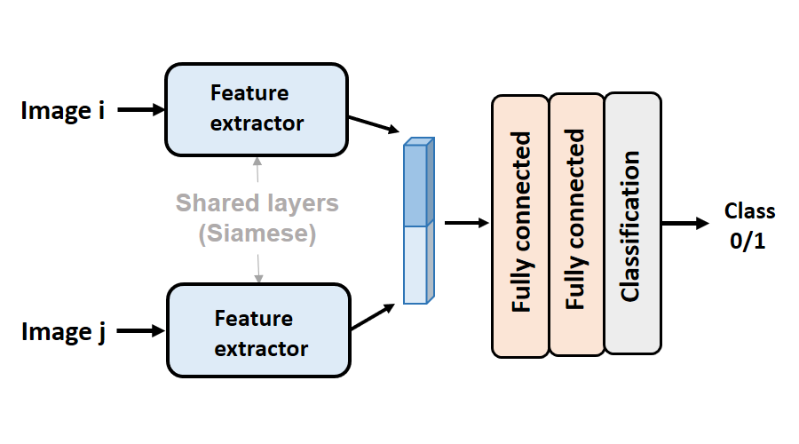

# Pairwise model

## Introduction

Pairwise model simplify the task into a binary classification of sentences. The model structure is shown below:

<div style="align: center">

</div>


## Requirement

- python 2.7
- Pytorch 0.4.1


## Data preparation

- Make sure you have obtained train/validation images under the guidance of [prepare image ordering data ](../)

  

## Run pairwise model

- All code is available at  ```Siamese-networks.ipynb ``` , follow the guidance in it to complete different process.
- The pre-trained model (with curriculum learning and without curriculum learning ) is available at [here](https://drive.google.com/file/d/1ZgzQZw4xwkBd2gsYuCEJvZcWPEha62OC/view?usp=sharing). Download and place them in ```pretrain_model/```

