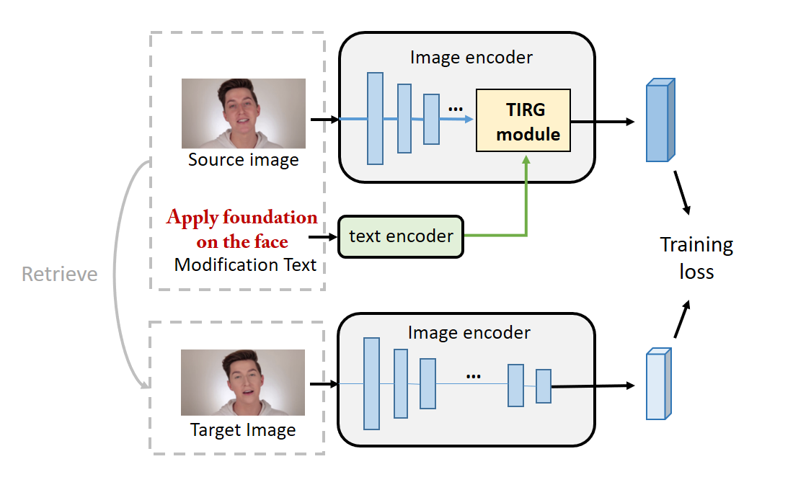

# TIRG_based Model

## Introduction

Makeup action descriptions can provide additional guidance to understand changes of facial appearance. Therefore, we formulate the core task as a compositional image retrieval problem given the query composited of an image and the text.  

We adopt the state-of-the-art model [Text Image Residual Gating (TIRG)](https://arxiv.org/abs/1812.07119) as our baseline model and 

build codes on top of  [Tirg code](https://github.com/google/tirg) in PyTorch. 


<div style="align: center">

</div>


## Requirement

- torchvision 0.2.1

- pytorch 0.4.1

- numpy 1.16.6

- tqdm

- tensorboardX 

  

## Data preparation


#### Data Download

Make sure you have obtained train/validation images under the guidance of [prepare image ordering data ](../)

#### Data Preprocessing

Generate mod information for train/val images.

```
python generate_mod_data.py
```


## Running Models

- `main.py`: driver script to run training/testing
- `datasets.py`: Dataset classes for loading images & generate training retrieval queries
- `text_model.py`: LSTM model to extract text features
- `img_text_composition_models.py`: various image text compostion models (described in [TIRG](https://arxiv.org/abs/1812.07119) paper)
- `torch_function.py`: contains soft triplet loss function and feature normalization function
- `makeup_test_retrieval.py`: functions to perform retrieval test and compute R@K performance


For training & testing, run:

```
python main.py --dataset=youmakeup --dataset_path=../shared_data/ --num_iters=400000 --model=concat --loss=batch_based_classification --learning_rate_decay_frequency=120000 --comment=makeup_multi --batch_size=32 --loader_num_workers=0
```

For evaluating  model results on R@K, run:

```
python evaluation.py 
```

Apply model to multiple choice questions of image ordering task, run:

```
python get_ordering_result.py
```


#### Pretrained Models:

Our pretrained models can be downloaded [here]().


#### Notes:

All log files will be saved at `./runs/`. Monitor with tensorboard (training loss, training retrieval performance, testing retrieval performance):

```
tensorboard --logdir ./runs/ --port 8888
```