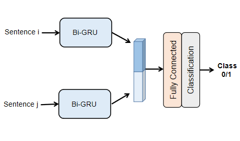

# Pairwise model

## Introduction
Pairwise model simplify the task into a binary classification of sentences. The model structure is shown below:



## Requirement
python 3.6 \
tensorflow 1.12

## Instruction
#### data download
- Download [YouMakeup dataset](https://github.com/AIM3-RUC/YouMakeup.git) and place it in the root dictionary.
- For glove word embedding, build ```./data``` in current path, download [glove.840B.300d_dict.npy](http://note.youdao.com/) and place it in file ```./data```.

#### generate train set and dev set

```
python data_prepare.py
```


#### Pairwise model operation
For model training, run:

```
python run_pairwise_ordering.py --task train
```
For model dev, claculate binary accuracy, run:

```
python run_pairwise_ordering.py --task dev --model model_id 
```

For model test, output answer for multi-choice questions, run:

```
python run_pairwise_ordering.py --task test --model model_id 
```


To calculate the accuracy of multiple choice questions, run:

```
python accuracy_calculate.py  
```

