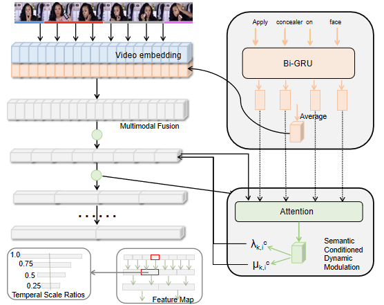

# SCDM_based Model

## Introduction
Since the correct order of step descriptions is corresponded to the video, temporally aligning each step description in the video can solve the step ordering task. Therefore, we formulate the core task as temporal activity localization via language (TALL)

We adopt one of state-of-the-art models [Semantic Conditioned Dynamic Modulation (SCDM)](https://arxiv.org/abs/1910.14303) as our baseline model for the TALL task. The code is available in ```grounding/SCDM```.

Furthermore, due to the fine-grained nature of our task, we propose an enhanced  model (SCDM+) based on SCDM which utilizes additional fine-grained guidance for training. The code is available in ```grounding/SCDM+```.

<div style="align: center">

</div>


Both code is based on [https://github.com/yytzsy/SCDM](https://github.com/yytzsy/SCDM)
## Requirement
- python 3.6 
- tensorflow 1.12
- CUDA 9.0

## Instruction


#### Data Download
- Download [YouMakeup dataset](https://github.com/AIM3-RUC/YouMakeup.git) and place it in the root dictionary.The file structure under the root is as followings:

  ```csharp
  ├─YouMakeup
  │  └─data
  │      ├─task
  │      ├─train
  │      └─valid
  └─Youmakeup_Baseline
      └─step_ordering
         ├─Pairwise
         └─SCDM_based
  ```
- Download the following file into ```../../../data```:
Extracted video features:
[makeup_c3d_rgb_stride_1s.zip](https://drive.google.com/open?id=1gPGEYej70hKM6e-ftXI0RBNzn4AokMJ1) or  [makeup_i3d_rgb_stride_1s.zip.]( https://drive.google.com/open?id=1cT5MKcmSmqS6xC_i2dI2wbJ3n7mdFh7o)\
For glove word embeddings used in baseline, download [glove.840B.300d_dict.npy](https://drive.google.com/open?id=1duGDi-NuC5WtIkknSO5_XViVEqZNS5DD) 

#### Data Preprocessing

```
python grounding/data_preparation/generate_makeup_data.py
```

#### SCDM_based model operation
Go to ```./grounding/SCDM/src_SCDM/``` or```./grounding/SCDM+/src_SCDM+/``` 

For model training, run:

```
python run_makeup_scdm.py --task train
```

For model dev, claculate R@n, IoU@m metric , run:

```
python run_makeup_scdm.py --task dev 
```

For model test, output answer for multi-choice questions, run:

```
python run_makeup_scdm.py --task test
```

To calculate the accuracy of multiple choice questions, run:

```
python accuracy_calculate.py  
```
For enhanced  model (SCDM+), the operation is similiar.

#### Checkpoints
Checkpoints of saved model is available in [SCDM(I3D)_checkpoints](https://drive.google.com/open?id=1P1AMpbY726bESI1NxygH4cZhH5NL4KtY), [SCDM(C3D)_checkpoints](https://drive.google.com/open?id=1HWyMxJPmk6kdBRT63pQaIXvgpx55yyab), [SCDM+(I3D)_checkpoint](https://drive.google.com/open?id=13QMJ5z5PBVkDFkuxxTpAwH5EJumJNITa). Download checkpoint and place it under ```./grounding/SCDM``` or ``` ./grounding/SCDM+```. You can use the checkpoints to reproduce the result in baseline paper.

